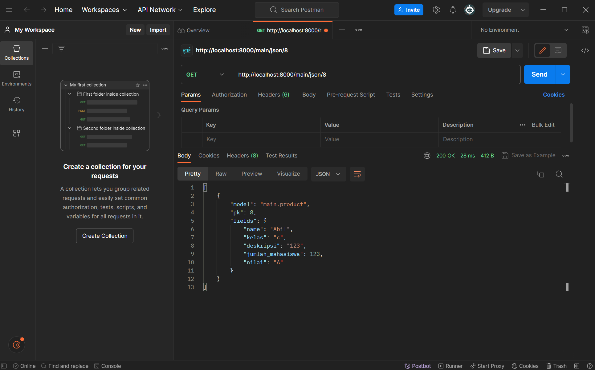
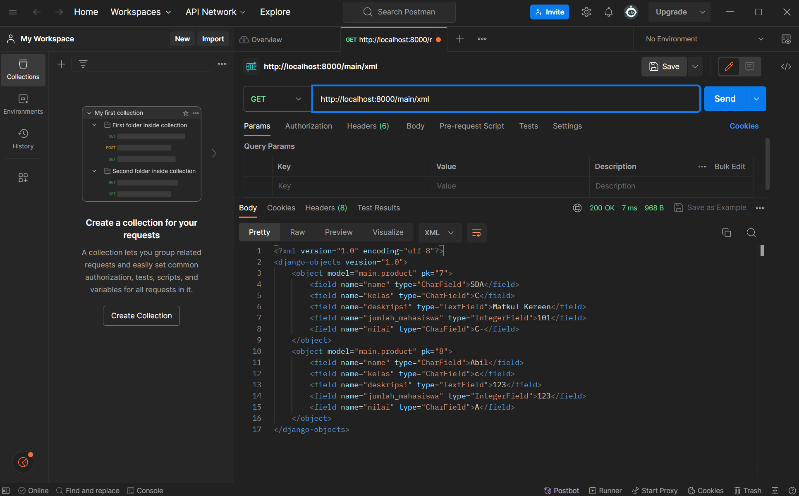

Link ke matkul review : https://matkul-review.adaptable.app/main/
link ke github matkul-review : https://github.com/bangABB/matkul_review

[TUGAS 5]
1. Kustomisasi :

     - Kustomisasi desain pada templat HTML yang telah dibuat pada Tugas 4 dengan menggunakan CSS atau CSS framework (seperti Bootstrap, Tailwind, Bulma) dengan ketentuan sebagai berikut **DONE**
     
     - Kustomisasi halaman daftar inventori menjadi lebih berwarna maupun menggunakan apporach lain seperti menggunakan Card. **DONE**

2. 1. Elemen selector itu seperti kita menerapkan semua style ke semua elemen, ibaratnya style dengan tipe global dan semua style yang ada akan terkena efeknya, kapan waktu yg tepat? mungkin ketika kita mau punya tema yang mirip2 antar satu komponen dengan yg lain
    
    2. HTML5 adalah versi terbaru dari bahasa markup HTML. Beberapa tag HTML5 yang saya ketahui termasuk:
        - Header
        - Footer
        - nav
3. - Margin adalah ruang di luar elemen HTML. Ini memengaruhi jarak antara elemen dengan elemen lain di sekitarnya. Margin tidak memiliki latar belakang atau warna.
    - Padding adalah ruang di sekitar konten dalam elemen HTML. Ini memengaruhi jarak antara konten elemen dan batas elemen itu sendiri. Padding dapat memiliki latar belakang atau warna, dan itu mempengaruhi tampilan elemen.
4.  - Tailwind:
        - Tailwind adalah framework CSS utility-first, yang berarti itu memberikan banyak kelas utilitas yang dapat digunakan untuk membangun antarmuka web dengan lebih fleksibel.
        Anda perlu menulis HTML dengan menggunakan kelas-kelas Tailwind untuk mengatur tampilan elemen.
        Cocok untuk proyek-proyek yang membutuhkan desain kustom dan tidak ingin terikat dengan gaya desain tertentu. Gunakan Tailwind jika Anda ingin lebih banyak kustomisasi dan fleksibilitas dalam desain tampilan Anda dan siap untuk menulis lebih banyak kode HTML untuk mengatur tampilan. Tailwind cocok untuk proyek-proyek yang membutuhkan desain yang sangat khusus dan unik.

    - Bootstrap:
        - Bootstrap adalah framework CSS yang lebih tradisional dengan komponen-komponen yang sudah dirancang sebelumnya. Ini memberikan lebih banyak komponen siap pakai yang dapat digunakan.
        Anda perlu mengikuti struktur komponen Bootstrap yang telah ditentukan.
        Cocok untuk proyek-proyek yang membutuhkan pengembangan cepat dengan tampilan yang konsisten.
        Gunakan Bootstrap jika Anda ingin membangun proyek dengan cepat dan menginginkan tampilan yang konsisten dan siap pakai.

5. Cara saya kustomisasi halaman login register dan tambah inventori --> memikirkan desain, membuat styling, implementasikan styling tadi
- Daftar inventori sudah di kustomisasi

- bonus sudah di kustomisasi dgn cara mengambil nth-last-child dari table nya

[TUGAS 4]

1. Django UserCreationForm adalah bagian dari Django's built-in authentication system yang digunakan untuk membuat formulir pendaftaran pengguna. Formulir ini  memudahkan pengembang untuk membuat halaman pendaftaran pengguna dengan cepat. Kelebihannya adalah:
    - Mudah Digunakan: Form ini telah disiapkan dan dapat digunakan dengan mudah dalam proyek Django tanpa perlu menulis kode form dari awal.
    - Validasi Terintegrasi: Form ini mencakup validasi bawaan untuk memastikan data yang dimasukkan pengguna sesuai dengan persyaratan yang diinginkan.

    Kekurangan :
    - UI jelek
    - keamanan ga terjamin

2. - Autentikasi adalah proses mengidentifikasi pengguna dengan memverifikasi identitasnya, seperti username dan password. Dalam konteks Django, ini melibatkan pendaftaran pengguna, login, dan verifikasi identitas pengguna.
   -  Otorisasi adalah proses memberikan akses atau izin kepada pengguna setelah mereka diotentikasi. Ini melibatkan pengaturan hak akses, seperti siapa yang bisa mengakses halaman tertentu atau melakukan tindakan tertentu dalam aplikasi.

3. Cookies adalah data kecil yang disimpan di sisi klien (browser) yang digunakan untuk mengidentifikasi pengguna dan menyimpan informasi sesi. Dalam konteks aplikasi web, cookies digunakan untuk mengelola data sesi pengguna, seperti informasi login atau preferensi.

4.  - Penggunaan cookies dalam pengembangan web dapat aman jika dilakukan dengan benar. Risiko potensial termasuk serangan seperti Cross-Site Scripting (XSS) jika data cookies tidak divalidasi dengan baik atau disimpan dengan cara yang rentan. Selain itu, ada risiko pencurian sesi jika cookies tidak dienkripsi dengan baik.

Untuk menjaga keamanan, pastikan untuk menggunakan HTTPS untuk mengenkripsi komunikasi dan gunakan fitur-fitur keamanan seperti HttpOnly dan Secure flags dalam cookies Anda.

5. - membuat fungsi yang dibutuhkan (login, logout, register)
    - mengimplementasikan page yang sesuai (login.html misalnya) dan menghubungkan ke urls.py agar terbaca
    - agar tidak bisa mengakses main sblm login, maka kita buat authorisation di atas fungsi showmain
    - untuk date time sendiri -> tiap login, disimpan date time sekarang di context org tersebut, value baru ini direplace, yg lama di hapus
    - migrate

**BONUS**
- untuk bonus saya juga implementasikan langkah tadi, bedanya ada function yang dibuat di models sehingga nanti ga susah kalo mau ngelakuin apa apa, langsung ke product

[TUGAS 3]
1. Apa perbedaan antara form POST dan form GET dalam Django?
    - Form Post
    Form POST adalah metode pengiriman data yang digunakan dalam pengembangan web, di mana data atau nilai dikirimkan langsung ke server. Kelebihan dari metode ini adalah data yang dikirimkan tidak ditampilkan di URL, sehingga lebih aman untuk mengirimkan data yang penting atau rahasia, seperti password.

    - Form Get
    Di sisi lain, Form GET adalah metode lain yang digunakan dalam pengiriman data formulir. Berbeda dengan form POST, form GET menampilkan data yang dikirimkan dalam URL. Hal ini berarti bahwa data yang dikirimkan dapat dilihat oleh siapa saja yang melihat URL. Dengan metode GET, browser mengemas data yang dikirimkan menjadi string, dan menggunakan ini untuk membuat URL. Meskipun kurang aman dibandingkan dengan metode POST, metode GET sangat berguna untuk mengambil data dari server. Metode GET menggunakan variabel $_GET untuk menampung data/nilai.

    Form GET seperti seorang pemandu wisata yang membawa kita berkeliling kota. Pemandu wisata ini akan menunjukkan semua tempat yang Anda kunjungi dan semua yang Anda lakukan akan tercatat dalam buku harian perjalanan Anda. Dalam hal ini, buku harian perjalanan adalah URL kita. Semua data yang dikirimkan akan ditampilkan di URL. Meskipun ini mungkin tidak seaman metode POST, metode GET sangat berguna saat kita hanya perlu mengambil data dari server.

2. Apa perbedaan utama antara XML, JSON, dan HTML dalam konteks pengiriman data?
    - XML (Extensible Markup Language)
    XML adalah bahasa markup yang digunakan untuk membuat dokumen yang dapat dibaca oleh manusia maupun mesin. XML biasanya digunakan untuk mengirim data yang kompleks dan sangat terstruktur seperti dokumen atau laporan keuangan. Selain itu, XML juga sering digunakan untuk pertukaran data dalam aplikasi bisnis dan enterprise. XML memerlukan lebih banyak spasi memori daripada JSON, karena XML memiliki tag yang membungkus setiap elemen datanya dan tag tersebut memakan ruang.
    
    - JSON (JavaScript Object Notation)
    JSON adalah format data ringkas dan ringan yang digunakan untuk pertukaran data antar client dan server. Sama halnya dengan XML, JSON juga dapat digunakan untuk mengirim data yang kompleks seperti struktur data dari REST API2. Meskipun terkesan ringan dan mudah digunakan, JSON memiliki keamanan data yang lebih baik dibandingkan XML. JSON dianggap lebih efisien karena data direpresentasikan sebagai objek JavaScript, dan dengan demikian beberapa bit dilewatkan melalui kabel. Lebih sedikit waktu mesin diperlukan untuk pemrosesan data.

    - HTML (HyperText Markup Language)
    HTML adalah bahasa markup standar untuk dokumen yang dirancang untuk ditampilkan di browser web. HTML tidak dirancang untuk pertukaran data, tetapi untuk menampilkan data dengan fokus pada bagaimana data tampak bagi pengguna akhir. HTML menggunakan tag untuk membuat elemen seperti teks, gambar, dan hyperlink lainnya menjadi output yang dapat ditampilkan oleh browser web.

3. Mengapa JSON sering digunakan dalam pertukaran data antara aplikasi web modern?
    Ada beberapa alasan yang mendasari penggunaan JSON dalam pertukaran data antara aplikasi web modern.
    - Ringan: JSON adalah format yang ringan, yang berarti membutuhkan lebih sedikit bandwidth dan mempercepat waktu transmisi data.
    - Mudah Dibaca dan Ditulis: JSON mudah dibaca dan ditulis oleh manusia, yang memudahkan pengembang dalam memahami dan menganalisis data selama proses pengembangan dan debugging.
    - Mudah Dipahami oleh Mesin: JSON mudah dipahami oleh mesin, yang memungkinkan data JSON diolah dengan mudah di berbagai platform.
    - Fleksibilitas dalam Representasi Data: JSON dapat merepresentasikan berbagai jenis data dengan format yang konsisten, termasuk tipe data dasar seperti string, angka, boolean, serta struktur yang lebih kompleks seperti objek dan array.
    - Kompatibilitas Lintas Platform: JSON didukung oleh sebagian besar bahasa pemrograman modern, sehingga data dalam format JSON dapat dengan mudah diolah dan dimanipulasi di berbagai platform dan lingkungan.
    - Efisiensi dalam Pertukaran Data: Karena format JSON bersifat ringan dan terstruktur, data dapat dikirim dengan cepat melalui jaringan dan diurai dengan mudah oleh klien.
    - Struktur Kode yang Lebih Sederhana: Berbeda dengan XML dan format lainnya yang memiliki fungsi serupa, JSON memiliki struktur data yang sederhana dan mudah dipahami.
    - Pertukaran Data yang Efisien: Salah satu fungsi utama JavaScript Object Notation adalah untuk memfasilitasi pertukaran data yang efisien antara server dan klien.

4. membuat input form dengan cara membuat method di views, membuat perubahan yang seharusnya di templates lalu re rout di urls. Untuk menampilkan data maka perlu dibuat juga methodnya mau all atau by id, lalu ditaro di urls.py link yang bersangkutan.

[TUGAS 2]
1. Panduan Langkah demi Langkah untuk Membuat Proyek Inventaris Perpustakaan

    Mengaktifkan Lingkungan Virtual
        Mengaktifkan lingkungan virtual adalah langkah penting untuk mengisolasi paket dan dependensi yang digunakan dalam aplikasi Anda, sehingga menghindari konflik dengan versi lain yang terpasang di komputer Anda.

    Membuat Proyek Django Baru
        Untuk memulai proyek, instal dependensi dengan perintah pip install -r requirements.txt, dan kemudian buat proyek Django baru dengan nama "library_inventory" menggunakan perintah django-admin startproject library_inventory.

    Konfigurasi Proyek dan Menjalankan Server
        Izinkan akses aplikasi web dengan menambahkan "*" pada ALLOWED_HOST di settings.py dalam direktori proyek library_inventory. Untuk memastikan direktori aktif, jalankan perintah python manage.py runserver.

    Membuat Aplikasi Utama (Main)
        Setelah mengatur proyek Django, buat aplikasi "main" dalam direktori proyek library_inventory. Aplikasi ini mengelola fungsi-fungsi khusus dalam proyek Anda. Buat aplikasi "main" dengan perintah python manage.py startapp main.

    Pengaturan Routing
        Langkah ini melibatkan pengalihan URL ke aplikasi utama yang telah Anda buat. Tambahkan routing ke file urls.py dalam direktori proyek library_inventory dengan menambahkan path('', include('main.urls')). Ini memastikan bahwa semua permintaan ke URL utama diteruskan ke aplikasi "main" untuk diproses.

    Membuat Model Item
        Untuk mendefinisikan struktur data dalam proyek, buat model Item dalam file models.py dalam aplikasi "main". Model ini mendefinisikan atribut seperti nama, jumlah, deskripsi, kategori, dan tanggal peminjaman.

    Membuat Fungsi di views.py
        Untuk mengelola logika proyek, buat fungsi "items" dalam file views.py dalam aplikasi "main". Fungsi ini mengambil data dari model Item dan merendernya ke dalam template HTML.

    Pengaturan Routing untuk Fungsi
        Tentukan routing untuk fungsi yang telah Anda buat dalam file views.py di dalam file urls.py. Routing ini menentukan bagaimana permintaan HTTP akan mencapai fungsi yang sesuai dalam aplikasi "main" ketika URL tertentu diakses.

    Implementasi Template HTML
        Buat template HTML dalam direktori baru dalam aplikasi "main". Template ini digunakan untuk mengatur tampilan halaman web yang akan diberikan kepada pengguna. Data yang diambil dari views.py akan dimasukkan ke dalam template ini.

    Testing Django
        Uji proyek dengan membuat uji unit dan kasus uji menggunakan model dari proyek library_inventory. Ini memastikan bahwa atribut proyek berfungsi dengan benar.

    Menambahkan, Mendorong, dan Melakukan Commit ke Repositori GitHub
        Setelah pengujian berhasil, unggah proyek ke repositori Library-Inventory di GitHub. Sebelum mengunggah, buat file .gitignore untuk menentukan file dan direktori yang harus diabaikan oleh Git. Selanjutnya, tambahkan, lakukan commit, dan dorong ke repositori GitHub.

    Penyediaan ke Adaptable
        Setelah mengembangkan aplikasi secara lokal, lakukan penyediaan ke server atau platform hosting yang dapat diakses secara online, memungkinkan orang lain mengaksesnya melalui internet.

    Membuat README.md
        Setelah menyelesaikan semua langkah, buat file README.md ini, yang berisi tautan ke aplikasi di Adaptable dan jawaban atas pertanyaan tentang proyek. Setelah selesai, tambahkan, lakukan commit, dan dorong ke repositori GitHub.

    Menonaktifkan Lingkungan Virtual
        Terakhir, nonaktifkan lingkungan virtual setelah selesai menggunakannya.

    semua telah di checklist dengan mantap dan selamat, nama user data dan data kelas serta aplikasi telah di amankan di dalam views.py sehingga pengmabilan data secara satu arah

2. Diagram Permintaan Client ke Aplikasi Web Django dan Hubungannya antara urls.py, views.py, models.py, dan Berkas HTML

    Browser Web Client
    |
    v
    Aplikasi Web Django
    |
    v
    |
    urls.py <---+---------> views.py
    | |
    v v
    models.py items.html

    

Dalam diagram ini, browser web pengguna memulai permintaan ketika mereka memasukkan URL atau mengklik tautan. Permintaan ini diterima oleh aplikasi web Django, yang memprosesnya dan mengirimkan respons kembali ke client. File urls.py bertanggung jawab untuk menentukan bagaimana cara mengarahkan permintaan URL ini dan menghubungkan URL yang diterima dari client ke fungsi tindakan yang disesuaikan dalam views.py. Ketika permintaan URL diteruskan oleh urls.py, views.py mengambil alih untuk memproses permintaan tersebut. views.py dapat mengakses model untuk memanipulasi data dan merender items.html atau mengembalikan respons JSON, tergantung pada kasus penggunaan. models.py mendefinisikan struktur data dalam aplikasi dan memberikan definisi model yang digunakan untuk berinteraksi dengan database atau sumber data lainnya. models.py dapat digunakan oleh views.py untuk mengambil atau menyimpan data. items.html digunakan untuk mengatur tampilan yang akan diberikan kepada pengguna. views.py dapat merender items.html dengan data yang diambil dari model dan kemudian mengirimkannya kembali ke client sebagai respons HTML yang siap ditampilkan.

3. Alasan Menggunakan Lingkungan Virtual dan Konsekuensi Tidak Menggunakan Lingkungan Virtual

Menggunakan lingkungan virtual adalah penting untuk mengisolasi lingkungan pengembangan Python, memungkinkan penggunaan paket dan dependensi proyek tertentu tanpa konflik dengan versi lain yang terpasang di sistem Anda. Ini juga memfasilitasi pengelolaan versi Python dan berbagai paket, memastikan kompatibilitas.

Tanpa lingkungan virtual, Anda sebenarnya dapat membuat aplikasi Django, tetapi ini tidak disarankan. Pendekatan ini dapat menyebabkan konflik paket, kesulitan mengelola berbagai versi Python, dan tantangan dalam mengisolasi dependensi proyek yang berbeda.

4. MVC, MVT, MVVM, dan Perbedaannya

    MVC (Model View Controller)
        Model, View, dan Controller adalah tiga komponen dari MVC. Model mengelola logika dan data dalam aplikasi, mengambil dan memanipulasi data, berinteraksi dengan Controller, terhubung ke database, dan memperbarui tampilan aplikasi. View mengelola antarmuka pengguna (HTML/CSS/XML) dan bekerja dengan Controller untuk membuat tampilan dinamis. Controller berperan sebagai penghubung antara View dan Model.

    MVT (Model View Template)
        MVT adalah variasi dari MVC yang digunakan dalam kerangka kerja Django. Dalam MVT, View berperan seperti Controller dalam MVC, sementara Template berperan seperti View dalam MVC.

    MVVM (Model View ViewModel)
        MVVM umumnya digunakan dalam pengembangan aplikasi berbasis kerangka kerja JavaScript dan dirancang untuk memisahkan logika tampilan dari Model. View berperan sebagai antarmuka grafis antara pengguna dan pola desain, menampilkan output dari data yang telah diproses. ViewModel berfungsi sebagai abstraksi dari View dan juga menyediakan pembungkus untuk data model.

Perbedaannya:

    Antara MVP dan MVT: MVT adalah variasi dari MVC yang digunakan dalam Django, di mana View berfungsi seperti Controller dalam MVC, dan Template berfungsi sebagai View dalam MVC.
    Antara MVVM dan MVC/MVT: MVVM lebih umum digunakan dalam pengembangan frontend dengan kerangka kerja JavaScript, sementara MVC/MVT biasanya terkait dengan pengembangan sisi server seperti Django. Selain itu, MVVM dirancang untuk lebih memisahkan logika tampilan dari Model dibandingkan dengan MVC/MVT.

    // Tambahan test case:
        1. test_main_contains_expected_data
            kalau yang didalem udah sesuai ama ekspektasi data yang ada di view
        
        2. test model produk
            buat instance product. lalu di dicheck apakah udah dibuat

        3. test kalau url invalid
            berhasil apabila dia 404

